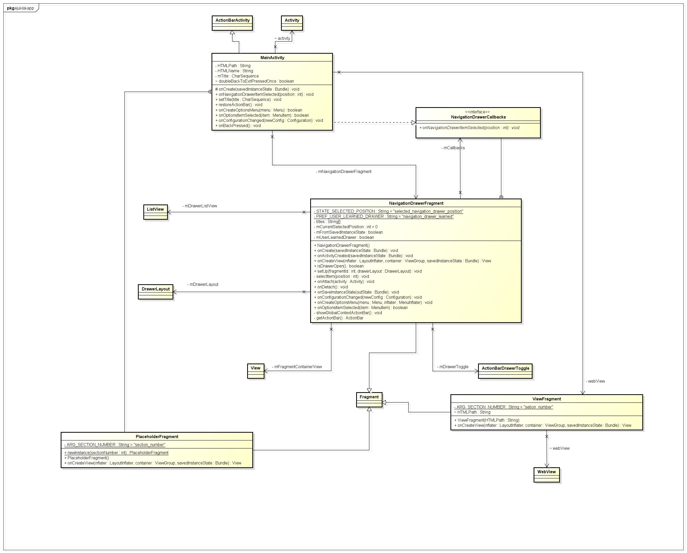

# Diagram Kelas e-Juklak

Aplikasi kami mempunyai tiga kelas yang berperan penting, yaitu :

  + Kelas Main Activity : berguna untuk mengatur aktivitas dari jalannya aplikasi e-Juklak
  + Kelas Navigation Drawer Fragment: berguna untuk menampilkan menu Samping / navigasi di aplikasi e-Juklak
  + Kelas View Fragment : berguna untuk membantu Main Activity menampilkan HTML di aplikasi e-Juklak
