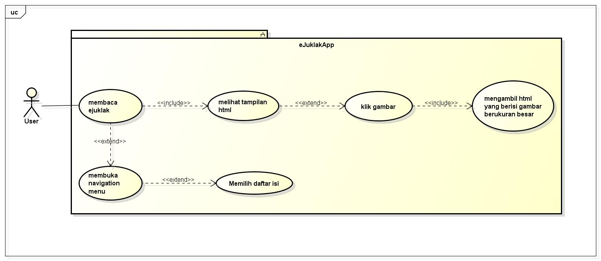

#Use Case

Penjelasan singkat usecase diagram : 

ketika user membuka aplikasi ejuklak, user dapat membaca juklak, atau membuka menu navigasi dan memilih daftar isi yang diinginkan. Aplikasi ejuklak pasti mengambil informasi dalam bentuk html. Di dalam html tersebut terdapat text dan juga gambar. User juga dapat melihat gambar yang sudah ada di dalam html dan dapat melihat gambar yang sudah diperbesar dengan cara tap 1 kali pada gambar tersebut. 
